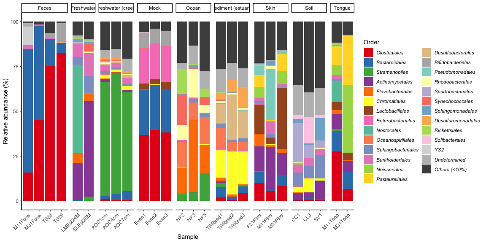
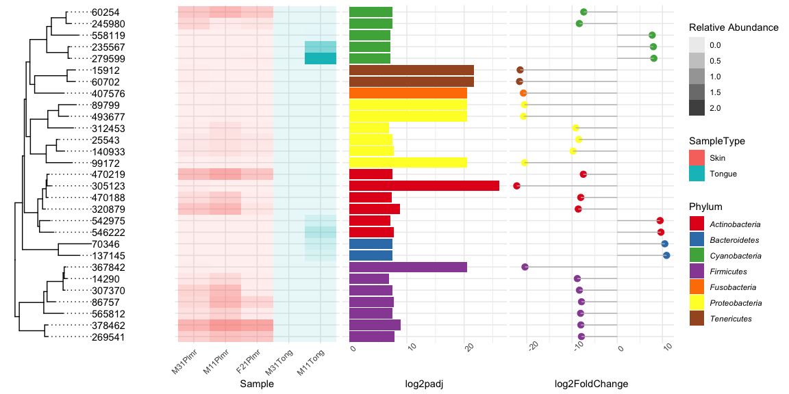

<!-- README.md is generated from README.Rmd. Please edit that file -->

# nyankomicro

<!-- badges: start -->

[](https://lifecycle.r-lib.org/articles/stages.html#experimental)

<!-- badges: end -->

nyankomicro is a in-house package that aims to make the plots more
beautiful.

The barplots created by various packages force annotations when the
annotation for a particular domain is unknown (e.g., NA, uncultured,
uncultured bacterium, etc.), which confuses the discussion. To avoid
these confusions, this package uniquely sets unknown annotations as
Undetermined. It will also show the taxonomy to be displayed if it is N%
or more in at least one sample.

## Installation

You can install the released version of demopckg from
[GitHub](https://github.com) with:

``` r
devtools::install_github("xvtyzn/nyankomicro")
```

``` r
devtools::update_packages("nyankomicro")
```

## Example

### Barplot

``` r
library(phyloseq)
library(nyankomicro)
data("GlobalPatterns")

microbiome_barplot(GlobalPatterns, "Order", "SampleType", 10)
```



Following the naming conventions for bacteria, italics are used to
classify bacteria below the family level.

``` r
microbiome_barplot(GlobalPatterns, "Family", "SampleType", 10)
```


nestしたカテゴリの可視化も可能です。

``` r
data(enterotype)
enterotype_na_omited <- subset_samples(enterotype, !is.na(Nationality))

microbiome_barplot(enterotype_na_omited, "Genus", c("Nationality", "ClinicalStatus"), 10)
```


### DEseq2 plot

#### ASV level

``` r
library(DESeq2)
library(tidyverse)
data("GlobalPatterns")

subGP <- subset_samples(GlobalPatterns, SampleType %in% c("Skin", "Tongue") )
  
deseq2_subGP <- subGP %>%
  phyloseq_to_deseq2(~SampleType) %>%
  DESeq() %>%
  results(cooksCutoff = FALSE)

ggtree_subGP <- deseq2_tree(subGP, deseq2_subGP,level = "Phylum", alpha = 0.01,
                            sample_annotation = "SampleType")
ggtree_subGP
```



#### Genus level

``` r
ggtree_subGP_genus <- deseq2_tree(subGP, deseq2_subGP,level = "Genus", alpha = 0.01,
                            sample_annotation = "SampleType", vis_domain = TRUE)
#> [1] "12ASVs were removed\n"
ggtree_subGP_genus
```


### Core microbiome estimation

コアmicrobiomeの決定には複数の議論が存在します。

そのため、以下ではcore
microbiomeの決定のために便利な幾つかの関数を提示します

#### threholdによる変動

#### ベン図での可視化

#### Upset図による可視化
