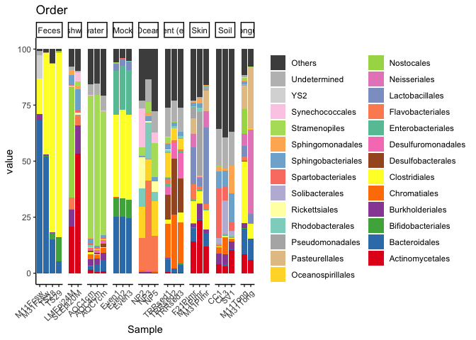

<!-- README.md is generated from README.Rmd. Please edit that file -->

# nyankomicro

<!-- badges: start -->

<!-- badges: end -->

nyankomicro is a in-house package that aims to make the plots more
beautiful.

## Installation

You can install the released version of demopckg from
[GitHub](https://github.com) with:

``` r
devtools::install_github("xvtyzn/nyankomicro")
```

## example

``` r
library(phyloseq)
library(nyankomicro)
data("GlobalPatterns")

microbiome_barplot(GlobalPatterns, "Order", "SampleType", 10)
#> Warning: `group_by_()` is deprecated as of dplyr 0.7.0.
#> Please use `group_by()` instead.
#> See vignette('programming') for more help
#> This warning is displayed once every 8 hours.
#> Call `lifecycle::last_warnings()` to see where this warning was generated.
#> Using Sample, X.SampleID, Primer, Final_Barcode, Barcode_truncated_plus_T, Barcode_full_length, SampleType, Description as id variables
```


